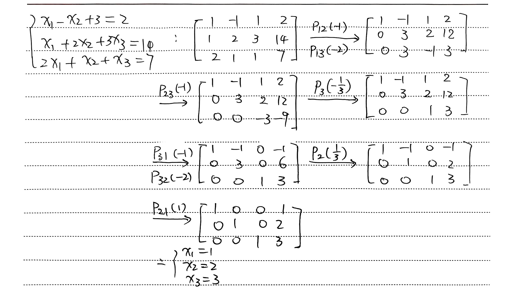

# 第二章 线性方程组

### 矩阵乘法

本章中我们将考察更加一般的线性方程组：

$$
\begin{cases} a_{1, 1} x_1 + \cdots + a_{1, n} x_n = b_1 \\ \cdots \\ a_{m, 1} x_1 + \cdots + a_{m, n} x_n = b_n \end{cases}
$$

记其系数矩阵为：

$$
\mathbf{A} = \begin{bmatrix} a_{1, 1} & \cdots & a_{1, n} \\ \vdots & & \vdots \\ a_{m, 1} & \cdots & a_{m, n} \end{bmatrix}
$$

记向量乘法：

$$
\begin{align}
\mathbf{a}_i &= \begin{bmatrix} a_{i, 1} & \cdots & a_{i, n} \end{bmatrix} \\
\mathbf{x} &= \begin{bmatrix} x_1 \\ \vdots \\ x_n \end{bmatrix} \\
\mathbf{a}_i \mathbf{x} &= \displaystyle\sum_{j = 1}^n a_{i, j} x_j
\end{align}
$$

等号右侧的数可以视作 $1 \times 1$ 矩阵。把 $m$ 行拼起来有：

$$
\begin{align}
\mathbf{b} &= \begin{bmatrix} b_1 \\ \cdots \\ b_m \end{bmatrix} \\
\mathbf{A} \mathbf{x} &= \mathbf{b}
\end{align}
$$

考虑进一步一般化：对于一些**系数矩阵一致**的线性方程组，我们可以将它们的 $x, b$ 拼起来吗？

$$
\begin{align}
\mathbf{C} &= \begin{bmatrix} \mathbf{c}_1 & \cdots & \mathbf{c}_k \end{bmatrix} \\
\mathbf{B} &= \begin{bmatrix} \mathbf{b}_1 & \cdots & \mathbf{b}_k \end{bmatrix} \\
\mathbf{A} \mathbf{C} &= \mathbf{B}
\end{align}
$$

- 为确保字母不冲突，这里用 $\mathbf{c}_i$ 表示未知数的列向量。

注意到 $\mathbf{A}, \mathbf{C}, \mathbf{B}$ 的大小分别为 $m \times n, n \times k, m \times k$。

------

定义：$\mathbf{A} = (a_{i, j})_{m \times n}$ 与 $\mathbf{U} = (u_{i, j})_{n \times p}$ 的积为一个 $m \times p$ 的矩阵，记作 $\mathbf{V} = (v_{i, j})_{m \times p}$，满足 $v_{i, j} \equiv \displaystyle\sum_{k = 1}^n a_{i, k} u_{k, j}$。

计算口诀：行左列右，横山倒出。（见讲义 P44）

------

下面是初等行 / 列变换的矩阵，称作**初等变换阵**：
$$
\mathbf{P}_i(\lambda)_{m \times m} = \begin{bmatrix} 1 \\ & \ddots \\ & & \lambda \\ & & & \ddots \\ & & & & 1 \end{bmatrix} \\
\mathbf{P}_i(\lambda) \cdot \mathbf{A} = P_i(\lambda)(\mathbf{A})
$$

- 如 $\mathbf{P}_i(1)_{m \times m} = \mathbf{I}_m$，乘了以后不变。
- 同理有 $\mathbf{A} \cdot \mathbf{P}_i(\lambda) = Q_i(\lambda)(\mathbf{A})$。

$$
\mathbf{P}_{p, q}(\lambda)_{m \times m} = \begin{bmatrix} 1 \\ & \ddots \\ & & 1 \\ & & & \ddots \\ & & \lambda & & 1 \\ & & & & & \ddots \\ & & & & & & 1 \end{bmatrix} \\
\mathbf{P}_{p, q}(\lambda) \cdot \mathbf{A} = P_{p, q}(\lambda)(\mathbf{A})
$$

- 这里不妨钦定 $p < q$。**注意是下三角处为 $\lambda$！**
- 一个更直观的理解方式是将 $\mathbf{A}$ 写成行向量沿列堆叠的形式。
- 同理有 $\mathbf{A} \cdot \mathbf{P}_{q, p}(\lambda) = Q_{p, q}(\lambda)(\mathbf{P})$。**想一想为什么反过来了？**

$$
\mathbf{P}_{p, q}(\lambda)_{m \times m} = \begin{bmatrix} 1 \\ & \ddots \\ & & 1 \\ & & & 0 & & & & 1 \\ & & & & 1 \\ & & & & & \ddots \\ & & & & & & 1 \\ & & & 1 & & & & 0 \\ & & & & & & & & 1 \\ & & & & & & & & & \ddots \\ & & & & & & & & & & 1 \end{bmatrix} \\
\mathbf{P}_{p, q}(\lambda) \cdot \mathbf{A} = P_{p, q}(\lambda)(\mathbf{A})
$$

- 这里同样钦定 $p < q$。
- 同样，一个更直观的理解方式是将 $\mathbf{A}$ 写成行向量沿列堆叠的形式。
- 同理有 $\mathbf{A} \cdot \mathbf{P}_{p, q} = Q_{p, q}(\mathbf{A})$。

------

$$
\mathbf{A}_{m \times n} \cdot \mathbf{U}_{n \times p} = \begin{bmatrix} \mathbf{a}_1 \\ \vdots \\ \mathbf{a}_m \end{bmatrix} \begin{bmatrix} \tilde{\mathbf{u}}_1 & \cdots & \tilde{\mathbf{u}}_p \end{bmatrix} =  \begin{bmatrix} \tilde{\mathbf{a}}_1 & \cdots & \tilde{\mathbf{a}}_n \end{bmatrix} \begin{bmatrix} \mathbf{u}_1 \\ \vdots \\ \mathbf{u}_n \end{bmatrix}
$$

~~想一想，为什么？~~

- 前者行列向量之积 $\mathbf{a}_i \tilde{\mathbf{u}}_j$ 恰为我们期待的 $v_{i, j}$。
- 后者行列向量之积 $\tilde{\mathbf{a}}_k \mathbf{u}_k$ 恰好给每个 $v_{i, j}$ 提供了 $a_{i, k} u_{k, j}$ 的贡献。
- 感性地说，前者等价于对 $(i, j)$ 分别求和，后者等价于枚举 $k$ 贡献给 $(i, j)$。
- **注意每种表示乘出来的矩阵大小。**

#### 矩阵乘法与转置

$(\mathbf{A} \mathbf{B})^T = \mathbf{B}^T \mathbf{A}^T$（依据定义证明）。

### 高斯消去法

考虑增广矩阵 $[\mathbf{A} \mid \mathbf{b}]_{m \times (n + 1)}$，现在我们关心原方程组的解集。

#### 同解变换

若 $[\mathbf{A} \mid \mathbf{b}], [\hat{\mathbf{A}} \mid \hat{\mathbf{b}}]$ 对应的方程组同解，则该变换为同解变换，记作 $[\mathbf{A} \mid \mathbf{b}] \sim [\hat{\mathbf{A}} \mid \hat{\mathbf{b}}]$。

- 自反性：$\mathbf{X} \sim \mathbf{X}$。
- 对称性：$\mathbf{X} \sim \mathbf{Y} \Leftrightarrow \mathbf{Y} \sim \mathbf{X}$。
- 传递性：$\mathbf{X} \sim \mathbf{Y} \sim \mathbf{Z} \Rightarrow \mathbf{X} \sim \mathbf{Z}$。

##### 定理：初等行变换都是同解变换。

- 证明思路：前的解均为后的解，后的解均为前的解。
- **不能直接说前后等价，因为这里就是要证明它们等价！**
- 感性地说，原因在于变换可逆。

#### 求解流程

[例] 讲义 P51 例 2.1

下面形式化地描述高斯消去法。

经初等行变换，将增广矩阵变为阶梯阵 $[\mathbf{A} \mid \mathbf{b}]_{m \times (n + 1)}$。

设变换得到的阶梯阵中，系数矩阵的最后一个非零行为 $r$。对于 $i \in \mathbb{N}_+ \land i \leq r$，设 $p_i$ 表示阶梯阵第 $i$ 行首个非零的列指标。

1. $r < m \land b_{r + 1} \neq 0$

第 $r + 1$ 个方程为 $0 = b_{r + 1}$，不可能成立，无解。

2. $r = m \lor b_{r + 1} = 0$

此时称前 $r$ 个方程为有效方程。

- (1) 若 $r = n$，此时 $\forall i \in \mathbb{N}_+ \land i \leq n, a_{i, i} \neq 0$，则系数矩阵的行列式非 $0$，由 **Cramer 法则** 知原方程组有唯一解。
- (2) 若 $r < n$，记 $1 \sim n$ 中其他指标为 $1 \leq s_{r + 1} < \cdots < s_n \leq n$，则将系数矩阵按**列**拆分为指标 $s_{\leq r}$ 和指标 $s_{> r}$ 的两个子式（记作 $\mathbf{A}_1, \mathbf{A}_2$），将未知数向量同样拆分为 $\mathbf{x}_1, \mathbf{x}_2$，令 $\mathbf{b}' = \begin{bmatrix} b_1 & \cdots & b_r \end{bmatrix}^T$，则 $\mathbf{A}_1 \mathbf{x}_1 = \mathbf{b}' - \mathbf{A}_2 \mathbf{x}_2$。此时 $\mathbf{A}_1$ 为 $r \times r$ 的**方阵**，故当我们确定了 $\mathbf{x}_2 \in \mathbb{R}^{n - r}$，由 **Cramer 法则** 知我们可以给出唯一的 $\mathbf{x}_1$。

最后有一个小问题：**自由变量 $s_{r + 1}, \cdots, s_n$ 的选取方式唯一吗？**

- 考虑方程 $x_1 + x_2 = 0$，不难看出你把哪个作为自由变量都是可以的。
- 但在消去过程中，我们并没有进行初等列变换，所以按照上面的方式选出的自由变量是唯一的。

### $n$ 维代数向量空间 $\mathbb{F}^n$

- 这里的 $\mathbb{F}$ 是一个数域 number field，比如 $\mathbb{R}, \mathbb{C}$。

记向量 $\mathbf{a} = (a_1, \cdots, a_n) \in \mathbb{F}^n$，其中 $a_i \in \mathbb{F}$。

- 下面有时不会区分行向量和列向量。

#### 加法

交换律：$\mathbf{a} + \mathbf{b} = \mathbf{b} + \mathbf{a}$。

结合律：$\mathbf{a} + (\mathbf{b} + \mathbf{c}) = (\mathbf{a} + \mathbf{b}) + \mathbf{c}$。

零元：$\exists \mathbf{0} = (0, \cdots, 0) \in \mathbb{F}^n, \text{s.t. } \forall a \in \mathbb{F}^n, \mathbf{a} + \mathbf{0} = \mathbf{0} + \mathbf{a} = \mathbf{a}$。

负元 / 逆元：$\forall \mathbf{a} \in \mathbb{F}^n, \exists (-\mathbf{a}) \in \mathbb{F}^n, \text{s.t. } \mathbf{a} + (-\mathbf{a}) = (-\mathbf{a}) + \mathbf{a} = \mathbf{0}$。

- 注意：负元的存在性是**被定义**的，但这里的 $-\mathbf{a}$ 是**记号**而非一种对 $\mathbf{a}$ 的**运算**，因为我们还没有证明其唯一性。

#### 数乘

关于**向量**的分配律：$\lambda (\mathbf{a} + \mathbf{b}) = \lambda \mathbf{a} + \lambda \mathbf{b}$。

关于**标量**的分配律：$(\lambda + \mu) \mathbf{a} = \lambda \mathbf{a} + \mu \mathbf{a}$。

关于**标量**的结合律：$\lambda (\mu \mathbf{a}) = (\lambda \mu) \mathbf{a}$。

单位元 unit：$\exists 1 \in \mathbb{F}, \text{s.t. } \forall \mathbf{a} \in \mathbb{F}^n, 1 \cdot \mathbf{a} = \mathbf{a}$。

#### 基本性质

##### 性质 1

内容：$\mathbf{0}$ 为唯一零元。

证明：假设 $\mathbf{0}^*$ 也是，则用两次单位元性质可知 $\mathbf{0} = \mathbf{0}^*$。

##### 性质 2

内容：$\mathbf{0}^*$ 为单位元 $\Leftrightarrow \exists \mathbf{a}^* \in \mathbb{F}^n, \text{s.t. } \mathbf{a}^* + \mathbf{0}^* = \mathbf{a}^*$。

证明（**尽可能不使用数域自身的性质，而是用抽象出来的向量性质处理**）：

- 前推后显然，下证后推前：

$$
\begin{align}
\forall \mathbf{a} \in \mathbb{F}^n, \mathbf{a} + \mathbf{0}^* &= \mathbf{a} + \mathbf{0} + \mathbf{0}^* \\
&= \mathbf{a} + (\mathbf{a}^* + (-\mathbf{a}^*)) + \mathbf{0}^* \\
&= \mathbf{a} + \mathbf{a}^* + ((-\mathbf{a}^*) + \mathbf{0}^*) \\
&= \mathbf{a} + \mathbf{a}^* + (-\mathbf{a}^*) \\
&= \mathbf{a} + (\mathbf{a}^* + (-\mathbf{a}^*)) \\
&= \mathbf{a} + \mathbf{0} \\
&= \mathbf{a}
\end{align}
$$

##### 性质 3

内容：$\forall \mathbf{a} \in \mathbb{F}^n$，$\mathbf{a}$ 的负元唯一。

证明：

- 假设 $\mathbf{a} \in \mathbb{F}^n$ 有不相等的两个逆元 $(-\mathbf{a}), \mathbf{b}$，则：

$$
\begin{align}
\mathbf{b} &= \mathbf{b} + (\mathbf{a} + (-\mathbf{a})) \\
&= (\mathbf{b} + \mathbf{a}) + (-\mathbf{a}) \\
&= \mathbf{0} + (-\mathbf{a}) \\
&= (-\mathbf{a})
\end{align}
$$

- 故 $\mathbf{b} = (-\mathbf{a})$，假设不成立。又由逆元的存在性，可知 $\mathbf{a}$ 的逆元唯一。

##### 性质 4

内容：$0 \cdot \mathbf{a} = \mathbf{0}$。

证明：
$$
\forall \mathbf{a} \in \mathbb{F}^n, 1 \cdot \mathbf{a} = (1 + 0) \cdot \mathbf{a} = 1 \cdot \mathbf{a} + 0 \cdot \mathbf{a} \Rightarrow 0 \cdot \mathbf{a} = \mathbf{0}
$$

##### 性质 5

内容：$\lambda \cdot \mathbf{0} = \mathbf{0}$。

证明：
$$
\lambda \cdot \mathbf{0} = \lambda \cdot (\mathbf{0} + \mathbf{0}) = \lambda \cdot \mathbf{0} + \lambda \cdot \mathbf{0} \Rightarrow \lambda \cdot \mathbf{0} = \mathbf{0}
$$

##### 性质 6

内容：$\lambda \cdot \mathbf{a} = \mathbf{0} \Leftrightarrow \lambda = 0 \lor \mathbf{a} = \mathbf{0}$。

证明：

- 后推前由性质 4, 5 易证，下证前推后：
- 考虑反证法，假设存在 $\lambda \neq 0, \mathbf{a} \neq \mathbf{0}$ 也满足 $\lambda \cdot \mathbf{a} = \mathbf{0}$，则 $\mathbf{a} = 1 \cdot \mathbf{a} = (\dfrac{1}{\lambda} \cdot \lambda) \cdot \mathbf{a} = \dfrac{1}{\lambda} \cdot (\lambda \cdot \mathbf{a}) = \dfrac{1}{\lambda} \cdot \mathbf{0} = \mathbf{0}$，与 $\mathbf{a} \neq \mathbf{0}$ 矛盾。

#### 减法

定义 $\mathbf{a} - \mathbf{b} \equiv \mathbf{a} + (-\mathbf{b})$。在实数中我们也是这样定义减法的。

#### 单位向量

定义单位向量 $\mathbf{e}_i \in \mathbb{F}^n$ 满足第 $j$ 个分量为 $[j = i]$，则我们可以将 $\mathbf{a} = (a_1, a_2, \cdots, a_n) \in \mathbb{F}^n$ **唯一地**表示为 $\displaystyle\sum_{i = 1}^n a_i \mathbf{e}_i$。

### 线性相关性

#### 线性相关

$\mathbf{a}_1, \mathbf{a}_2, \cdots, \mathbf{a}_m \in \mathbb{F}^n$，若 $\exists \lambda_1, \cdots, \lambda_m \in \mathbb{F}$ **不全**为 $0$，使得 $\displaystyle\sum_{i = 1}^m \lambda_i \mathbf{a}_i = \mathbf{0}$，则称 $\mathbf{a}_1, \cdots, \mathbf{a}_m$ 线性相关 linearly dependent，也可以说向量组 $\{\mathbf{a}_1, \cdots, \mathbf{a}_m\}$ 线性相关。

- e.g. $\{\mathbf{a}_1, \cdots, \mathbf{a}_m, \mathbf{0}\}$ 线性相关。

#### 线性无关

$\mathbf{a}_1, \mathbf{a}_2, \cdots, \mathbf{a}_m \in \mathbb{F}^n$，若要使 $\displaystyle\sum_{i = 1}^m \lambda_i \mathbf{a}_i = \mathbf{0}$，只能令 $\lambda_1 = \cdots = \lambda_m = 0$，则称 $\{\mathbf{a}_1, \cdots, \mathbf{a}_m\}$ 线性无关 linearly independent。

#### 增广矩阵相关

有解增广矩阵的列向量线性相关，因为可以取 $\begin{cases} \forall i \in \mathbb{N}_+ \land i \leq n, \lambda_i = x_i \\ \lambda_{m + 1} = -1 \end{cases}$。

#### 线性相关的判定

设 $\mathbf{a}_i = (a_{1, i}, \cdots, a_{n, i}) \in \mathbb{F}^n$，考察线性方程组 $\forall j \in \mathbb{N}_+ \land j \leq n, \displaystyle\sum_{i = 1}^m x_i a_{j, i} = 0$ 是否存在非零解即可。

#### 命题：$\mathbf{a}_1, \cdots, \mathbf{a}_m \in \mathbb{F}^n, m > n$，则 $\{\mathbf{a}_1, \cdots, \mathbf{a}_m\}$ 线性相关。

证明：

- 由于 $m > n$，未知数数量小于方程数量，由高斯消去法可知原方程有无数解。
- 因此，任取一组非全 $0$ 解即可得证。

#### 线性表出

$\mathbf{a}_1, \cdots, \mathbf{a}_m, \mathbf{b} \in \mathbb{F}^n$，若 $\exists \lambda_1, \cdots, \lambda_m \in \mathbb{F}$，使得 $\displaystyle\sum_{i = 1}^m \lambda_i \mathbf{a}_i = \mathbf{b}$，则称 $\mathbf{b}$ 可由 $\{\mathbf{a}_1, \cdots, \mathbf{a}_m\}$ 线性表出。

若 $\{\mathbf{b}_1, \cdots, \mathbf{b}_s\}$ 中每一项均可由 $\{\mathbf{a}_1, \cdots, \mathbf{a}_m\}$ 线性表出，则称 $\{\mathbf{b}_1, \cdots, \mathbf{b}_s\}$ 可由 $\{\mathbf{a}_1, \cdots, \mathbf{a}_m\}$ 线性表出。

若 $\{\mathbf{a}_1, \cdots, \mathbf{a}_m\}, \{\mathbf{b}_1, \cdots, \mathbf{b}_s\}$ 分别可以线性表出对方，则称两者等价，即 $\{\mathbf{a}_1, \cdots, \mathbf{a}_m\} \sim \{\mathbf{b}_1, \cdots, \mathbf{b}_s\}$。

- “同解变换”描述的就是“等价”。

#### 定理：$\{\mathbf{a}_1, \cdots, \mathbf{a}_m\}$ 线性相关当且仅当 $\exists i \in \mathbb{N}_+ \land i \leq m, \text{s.t. } \mathbf{a}_i$ 可由其他向量线性表出。

证明：

- 充分性：$\exists \lambda_1, \cdots, \lambda_{i - 1}, \lambda_{i + 1}, \cdots, \lambda_m \in \mathbb{F}, \text{s.t. } \mathbf{a}_i = \displaystyle\sum_{j \neq i} \lambda_j \mathbf{a}_j$。
- 令 $\lambda_i = -1$，则有 $\displaystyle\sum_{j = 1}^m \lambda_j \mathbf{a}_j = 0$。
- 此时 $\lambda_1, \cdots, \lambda_m$ 不全为 $0$，故原向量组线性相关。
- 必要性：由已知，$\exists \lambda_1, \cdots, \lambda_m \in \mathbb{F}^n$ 不全为 $0$，$\text{s.t. } \displaystyle\sum_{i = 1}^m \lambda_i \mathbf{a}_i = 0$。
- 可取 $i$ 使得 $\lambda_i \neq 0$，则 $\mathbf{a}_i = \displaystyle\sum_{j \neq i} (-\dfrac{\lambda_j}{\lambda_i}) \mathbf{a}_j$，故 $a_i$ 可由其他向量线性表出。

#### 定理：若 $\{\mathbf{b}_1, \cdots, \mathbf{b}_s\}$ 可由 $\{\mathbf{a}_1, \cdots, \mathbf{a}_m\}$ 线性表出，且 $s > m$，则 $\{\mathbf{b}_1, \cdots, \mathbf{b}_s\}$ 线性相关。

证明：

- $\forall i \in \mathbb{N}_+ \land i \leq s, \exists \lambda_{i, 1}, \cdots, \lambda_{i, m} \in \mathbb{F}, \text{s.t. } \mathbf{b}_i = \displaystyle\sum_{j = 1}^m \lambda_{i, j} \mathbf{a}_j$。
- 取 $\mu_1, \cdots, \mu_s \in \mathbb{F}$ 且这 $s$ 个数不全为 $0$，则 $\displaystyle\sum_{i = 1}^s \mu_i \mathbf{b}_i = \sum_{j = 1}^m (\sum_{i = 1}^s \mu_i \lambda_{i, j}) \mathbf{a}_j$。
- 要使 $\{\mathbf{b}_1, \cdots, \mathbf{b}_s\}$ 线性相关，只要 $\displaystyle\sum_{i = 1}^s \mu_i \mathbf{b}_i = \mathbb{0}$，进而只要 $\forall j \in \mathbb{N}_+ \land j \leq m, \displaystyle\sum_{i = 1}^s \mu_i \lambda_{i, j} = 0$。
- 这是一个关于 $\mu_1, \cdots, \mu_s$ 的线性方程组。由于 $s > m$，未知数数量小于方程数量，由高斯消去法可知原方程有无数解。
- 因此，任取一组非零解即可得证。

#### 定理：矩阵的行向量组和它经初等行变换后得到的矩阵的行向量组等价。

证明略。

#### 等价关系的基本性质

##### 自反性：$\{\mathbf{a}_1, \cdots, \mathbf{a}_m\} \sim \{\mathbf{a}_1, \cdots, \mathbf{a}_m\}$。

证明略。

##### 对称性：$\{\mathbf{a}_1, \cdots, \mathbf{a}_m\} \sim \{\mathbf{b}_1, \cdots, \mathbf{b}_s\} \Leftrightarrow \{\mathbf{b}_1, \cdots, \mathbf{b}_s\} \sim \{\mathbf{a}_1, \cdots, \mathbf{a}_m\}$。

证明略。

##### 传递性：$\{\mathbf{a}_1, \cdots, \mathbf{a}_m\} \sim \{\mathbf{b}_1, \cdots, \mathbf{b}_s\}, \{\mathbf{b}_1, \cdots, \mathbf{b}_s\} \sim \{\mathbf{c}_1, \cdots, \mathbf{c}_t\} \Rightarrow \{\mathbf{a}_1, \cdots, \mathbf{a}_m\} \sim \{\mathbf{c}_1, \cdots, \mathbf{c}_t\}$。

证明：

- $\forall i \in \mathbb{N}_+ \land i \leq t, \exists \lambda_1, \cdots, \lambda_s \in \mathbb{F}, \text{s.t. } \mathbf{c}_i = \displaystyle\sum_{j = 1}^s \lambda_j \mathbf{b}_j$。
- $\forall p \in \mathbb{N}_+ \land p \leq s, \exists \mu_{p, q}, \cdots, \mu_{p, q} \in \mathbb{F}, \text{s.t. } \mathbf{b}_p = \displaystyle\sum_{q = 1}^m \mu_{p, q} \mathbf{a}_q$。
- 把下面代入上面即可化简得 $\mathbf{c}_i = \displaystyle\sum_{q = 1}^m (\sum_{j = 1}^n \lambda_j \mu_{j, q}) \mathbf{a}_q$。
- 故前者可线性表出后者，反之亦然。

#### 定理：$\{\mathbf{a}_1, \cdots, \mathbf{a}_m\} \sim \{\mathbf{b}_1, \cdots, \mathbf{b}_s\}$，若两者各自线性无关，则 $m = s$。

证明：

- 若 $\{\mathbf{b}_1, \cdots, \mathbf{b}_s\}$ 可由 $\{\mathbf{a}_1, \cdots, \mathbf{a}_m\}$ 线性表出，但 $\{\mathbf{b}_1, \cdots, \mathbf{b}_s\}$ 线性无关，则 $s \leq m$（**必要条件**）。
- 反之，同理有 $m \leq s$，故 $m = s$。

#### 扩充与缩减

##### 定义

向 $\{\mathbf{a}_1, \cdots, \mathbf{a}_m\}$ 中添加 $s - m$ 个向量变成 $\{\mathbf{a}_1, \cdots, \mathbf{a}_m, \mathbf{a}_{m + 1}, \cdots, \mathbf{a}_s\}$，后者称作前者的扩充，前者称作后者的缩减。

- 这里序号无所谓，仅做示例。

##### 定理：扩充线性相关的向量组得到的一定是线性相关的向量组，缩减线性无关的向量组得到的一定是线性无关的向量组。

证明略。

#### 接长与截短

##### 定义

将向量 $\mathbf{a} = (a_1, \cdots, a_n) \in \mathbb{F}^n$ 变换为向量 $\mathbf{a}' = (a_1, \cdots, a_n, a_{n + 1}, \cdots, a_s) \in \mathbb{F}^s$，其中 $s > n$，后者称作前者的接长，前者称作后者的截短。

- 这里分量编号无所谓，仅做示例。

##### 定理：接长线性无关的向量组得到的一定是线性无关的向量组，截短线性相关的向量组得到的一定是线性相关的向量组。

- _Motivation：方程数增多后，新方程组的解集是原方程组的解集的子集。_

证明略。

#### 极大线性无关组

##### 定义

从 $\{\mathbf{a}_1, \cdots, \mathbf{a}_m\}$ 中选出 $1 \leq i_1 < \cdots < i_r \leq m$，使得：

- $\{\mathbf{a}_{i_1}, \cdots, \mathbf{a}_{i_r}\}$ 线性无关。
- $\forall k \in \mathbb{N}_+ \land k \leq m, \{\mathbf{a}_{i_1}, \cdots, \mathbf{a}_{i_r}, \mathbf{a}_k\}$ 线性相关。

此时称 $\{\mathbf{a}_{i_1}, \cdots, \mathbf{a}_{i_r}\}$ 为 $\{\mathbf{a}_1, \cdots, \mathbf{a}_m\}$ 的一个极大线性无关组，简称极大无关组。

##### 命题：$\forall k \in \mathbb{N}_+ \land k \leq m, \mathbf{a}_k$ 可由 $\{\mathbf{a}_{i_1}, \cdots, \mathbf{a}_{i_r}\}$ 线性表出。

证明：

- 由于 $\{\mathbf{a}_{i_1}, \cdots, \mathbf{a}_{i_r}, \mathbf{a}_k\}$ 线性相关，$\exists \lambda_1, \cdots, \lambda_r, \mu \in \mathbb{F}$ 不全为 $0$，使得 $\displaystyle\sum_{j = 1}^r \lambda_j \mathbf{a}_{i_j} + \mu \mathbf{a}_k = 0$。
- **断言** $\mu \neq 0$，否则 $\lambda_1, \cdots, \lambda_r$ 非全 $0$ 且 $\displaystyle\sum_{j = 1}^r \lambda_j \mathbf{a}_{i_j} = 0$，即 $\{\mathbf{a}_{i_1}, \cdots, \mathbf{a}_{i_r}\}$ 线性相关，与题意矛盾。
- 故 $\mathbf{a}_k = \displaystyle\sum_{j = 1}^r (-\dfrac{\lambda_j}{\mu}) \mathbf{a}_{i_j}$，即 $\mathbf{a}_k$ 可由 $\{\mathbf{a}_{i_1}, \cdots, \mathbf{a}_{i_r}\}$ 线性表出。

##### 命题：若 $\{\mathbf{a}_{i_1}, \cdots, \mathbf{a}_{i_r}\}, \{\mathbf{a}_{j_s}, \cdots, \mathbf{a}_{j_s}\}$ 都是 $\{\mathbf{a}_1, \cdots, \mathbf{a}_m\}$ 的极大无关组，则 $\{\mathbf{a}_{i_1}, \cdots, \mathbf{a}_{i_r}\} \sim \{\mathbf{a}_{j_s}, \cdots, \mathbf{a}_{j_s}\}$。

证明：$\{\mathbf{a}_{i_1}, \cdots, \mathbf{a}_{i_r}\} \sim \{\mathbf{a}_1, \cdots, \mathbf{a}_m\}, \{\mathbf{a}_{j_s}, \cdots, \mathbf{a}_{j_s}\} \sim \{\mathbf{a}_1, \cdots, \mathbf{a}_m\} \Rightarrow \{\mathbf{a}_{i_1}, \cdots, \mathbf{a}_{i_r}\} \sim \{\mathbf{a}_{j_s}, \cdots, \mathbf{a}_{j_s}\}$。

##### 推论：上一命题中 $r = s$。

证明略。

#### 向量的秩 rank

##### 定义

将 $\{\mathbf{a}_1, \cdots, \mathbf{a}_m\}$ 的极大无关组中的向量个数称为其秩，记作 $\operatorname{rank}(\mathbf{a}_1, \cdots, \mathbf{a}_m)$。

##### 定理：$\{\mathbf{a}_1, \cdots, \mathbf{a}_m\}$ 线性无关当且仅当 $\operatorname{rank}(\mathbf{a}_1, \cdots, \mathbf{a}_m) = m$。

证明略。

##### 定理：若 $\{\mathbf{a}_1, \cdots, \mathbf{a}_m\} \sim \{\mathbf{b}_1, \cdots, \mathbf{b}_s\}$，则 $\operatorname{rank}(\{\mathbf{a}_1, \cdots, \mathbf{a}_m\}) = \operatorname{rank}(\{\mathbf{b}_1, \cdots, \mathbf{b}_s\})$。

证明：分别取两者的极大无关组 $\{\mathbf{a}_{i_1}, \cdots, \mathbf{a}_{i_r}\}, \{\mathbf{b}_{j_1}, \cdots, \mathbf{b}_{j_s}\}$，则 $\{\mathbf{a}_1, \cdots, \mathbf{a}_m\} \sim \{\mathbf{a}_{i_1}, \cdots, \mathbf{a}_{i_r}\}, \{\mathbf{b}_1, \cdots, \mathbf{b}_s\} \sim \{\mathbf{b}_{j_1}, \cdots, \mathbf{b}_{j_s}\} \Rightarrow \{\mathbf{a}_{i_1}, \cdots, \mathbf{a}_{i_r}\} \sim \{\mathbf{b}_{j_1}, \cdots, \mathbf{b}_{j_s}\}$。

由上面的推论得 $r = s$，即结论成立。

##### 求法

法一：逐个检验向量组中的某个向量是否能被先前加入无关组的向量线性表出，不能则加入，最终得到的一定是极大无关组。

法二：_参见下文“矩阵的秩”中的内容。_

#### 矩阵的秩

##### 定义：行秩与列秩

对于矩阵 $\mathbf{A} = (a_{i, j})_{m \times n} = \begin{bmatrix} \mathbf{a}_1 & \cdots & \mathbf{a}_m \end{bmatrix}^T = \begin{bmatrix} \tilde{\mathbf{a}}_1 & \cdots & \tilde{\mathbf{a}}_n \end{bmatrix}$，将 $\operatorname{rank}(\mathbf{a}_1, \cdots, \mathbf{a}_m)$ 称作 $\mathbf{A}$ 的行秩，将 $\operatorname{rank}(\tilde{\mathbf{a}}_1, \cdots, \tilde{\mathbf{a}}_n)$ 称作 $\mathbf{A}$ 的列秩。 

##### 定理：行秩与列秩相等。

###### 特殊情况：阶梯阵

设非零行恰为前 $r$ 行，对于 $i \in \mathbb{N}_+ \land i \leq r$，设 $p_i$ 表示阶梯阵第 $i$ 行首个非零的列指标。

考虑行秩：

- 显然行向量的极大无关组中不含 $\mathbf{0}$，则行秩 $\leq r$。
- 假设 $\exists \lambda_1, \cdots, \lambda_r \in \mathbb{F}, \text{s.t. } \displaystyle\sum_{i = 1}^r \lambda_i \mathbf{a}_i = \mathbf{0}$。
- 考察第 $p_1$ 列，可知 $\lambda_1 = 0$；继续考察第 $p_2$ 列，可知 $\lambda_2 = 0$；如此续行，可知 $\forall i \in \mathbb{N}_+ \land i \leq r, \lambda_i = 0$。
- 于是 $\{\mathbf{a}_1, \cdots, \mathbf{a}_r\}$ 是线性无关组，则行秩 $\geq r$。
- 综上，行秩为 $r$。

考虑列秩：

- 注意到任一列向量只有前 $r$ 个分量可能非 $0$，显然将每个列向量截短，只保留前 $r$ 个分量，这不会改变线性相关性，且得到的向量在 $\mathbb{F}^r$ 中，则列秩 $\leq r$。 
- 考察 $\{\tilde{\mathbf{a}}_{p_1}, \cdots, \tilde{\mathbf{a}}_{p_r}\}$，同讨论 $\{\mathbf{a}_1, \cdots, \mathbf{a}_r\}$ 之理可知其为线性无关组，则列秩 $\geq r$。
- 综上，列秩也为 $r$。

综上，此时行秩与列秩相等，均为 $r$。

###### 一般化：进行初等行变换

考虑行秩：

- 初等行变换前后的行向量组等价，故行秩不变。

考虑列秩：

- _Motivation：初等行变换对列向量每一个分量的改变是同步的。_
- 从 $\{\tilde{\mathbf{a}}_1, \cdots, \tilde{\mathbf{a}}_m\}$ 中选出 $1 \leq i_1 < \cdots < i_s \leq m$，我们要证明列向量组 $\{\tilde{\mathbf{a}}_{i_1}, \cdots, \tilde{\mathbf{a}}_{i_s}\}$ 的线性相关性在变换后不变，即“使得 $\displaystyle\sum_{j = 1}^s \lambda_j \tilde{\mathbf{a}}_{i_j} = \mathbf{0}$ 成立的 $\lambda_1, \cdots, \lambda_s \in \mathbb{F}$ 是否必须为全 $0$”在变换前后不变。
- 记 $\tilde{\mathbf{a}}_i = (a_{1, i}, \cdots, a_{n, i})$，则上述等式可以展开为如下关于 $\lambda_1, \cdots, \lambda_s$ 的线性方程组：

$$
\forall k \in \mathbb{N}_+ \land k \leq n, \sum_{j = 1}^s a_{k, i_j} \lambda_j = 0
$$

- 注意到对原方程组进行初等行变换等价于对该方程组进行初等行变换，而变换前后线性方程组同解，于是列向量组在初等行变换后的线性相关性不变。
- 故列秩不变。

因此，通过高斯消去法将原矩阵变换为阶梯阵，据特殊情况的结果立即可得。

##### 定义：矩阵的秩

定义 $\operatorname{rank}(\mathbf{A})$ 为 $\mathbf{A}$ 的行秩或列秩，称为 $\mathbf{A}$ 的秩。

##### 定理（秩的判定）：(1) $\mathbf{A}$ 必有 $\operatorname{rank}(\mathbf{A})$ 阶非零子式；(2) 所有 $\operatorname{rank}(\mathbf{A}) + 1$ 阶子式均为 $0$（如果有）。

设 $r = \operatorname{rank}(\mathbf{A})$。首先证明 (1)：

思路一：

- 阶梯阵：设非零行恰为前 $r$ 行，对于 $i \in \mathbb{N}_+ \land i \leq r$，设 $p_i$ 表示阶梯阵第 $i$ 行首个非零的列指标。取第 $1, \cdots, r$ 行和第 $p_1, \cdots, p_r$ 列构成的子式，该 $r$ 阶子式非零。
- 一般化：任取行向量组的一个极大无关组 $S_1$，其大小为 $r$，且与消成阶梯阵后的前 $r$ 行构成的向量组 $S_2$ 等价。具体地说，极大无关组与原向量组同构，原向量组与阶梯阵的向量组等价，阶梯阵的向量组与阶梯阵的前 $r$ 行构成的向量组等价。对于 $S_1, S_2$ 中的各向量，只留下第 $p_1, \cdots, p_r$ 个分量，得到的 $S_2'$ 对应的子式非零，于是得到的 $S_1'$ 对应的 $r$ 阶子式也非零。

思路二：

- 在 $\mathbf{A}_{m \times n}$ 中取出 $r$ **行**线性无关，构成 $\tilde{\mathbf{A}}_{r \times n}$，则 $\operatorname{rank}(\tilde{\mathbf{A}}) = r$。
- 于是 $\tilde{\mathbf{A}}$ 中存在 $r$ **列**线性无关，取出 $r$ 列得到 $\hat{\mathbf{A}}_{r \times r}$，则 $\operatorname{rank}(\hat{\mathbf{A}}) = r, |\hat{\mathbf{A}}| \neq 0$。
- 故 $|\hat{\mathbf{A}}|$ 为 $\mathbf{A}$ 的一个 $r$ 阶非零子式。

------

接下来证明 (2)：

任取 $r + 1$ 个行向量（如果有）必然线性相关，则同步截短至 $r + 1$ 个分量所得的行向量组也必然线性相关，则所有 $r + 1$ 阶子式均为 $0$。

### 线性方程组的解的存在性

#### 系数阵为方阵的情况

即先前讨论过的 $\mathbf{A} \mathbf{x} = \mathbf{b}$，用 Cramer 法则即可判定。

##### 齐次方程组（即 $\mathbf{b} = \mathbf{0}$ 的情况）

由 **Cramer 法则** 可知：$\mathbf{A} \mathbf{x} = \mathbf{0}$ 有唯一解当且仅当 $|\mathbf{A}| \neq 0$，即 $\mathbf{A}$ 非奇异。

##### 一般情况

若方程 $\mathbf{A} \mathbf{x} = \mathbf{b}$ 无解，则将 $[\mathbf{A} \mid \mathbf{b}]$ 通过高斯消去法得到的阶梯阵中存在一行，使得其前 $n$ 个元素全零但第 $n + 1$ 个元素非零，则消去 $\mathbf{A}$ 得到的阶梯阵中这一行全零，故此时 $|\mathbf{A}| = 0$，即 $\mathbf{A}$ 奇异。

若方程 $\mathbf{A} \mathbf{x} = \mathbf{b}$ 存在多解，取其中两个解 $\mathbf{x}_1, \mathbf{x}_2$ 满足 $\mathbf{x}_1 - \mathbf{x}_2 \neq \mathbf{0}$，则：

$$
\begin{cases}
\mathbf{A} \mathbf{x}_1 = \mathbf{b} \\
\mathbf{A} \mathbf{x}_2 = \mathbf{b}
\end{cases}
\Rightarrow \mathbf{A} (\mathbf{x}_1 - \mathbf{x}_2) = \mathbf{0}
$$

于是 $\mathbf{A} \tilde{\mathbf{x}} = \mathbf{0}$ 有非零解为 $\mathbf{x}_1 - \mathbf{x}_2$，故此时 $|\mathbf{A}| = 0$，即 $\mathbf{A}$ 奇异。

##### 定理：$\mathbf{A} \mathbf{x} = \mathbf{0}$ 只有零解 $\Leftrightarrow \mathbf{A} \mathbf{x} = \mathbf{b}$ 有唯一解 $\Leftrightarrow |\mathbf{A}| \neq 0 \Leftrightarrow |\mathbf{A}|$ 满秩 $\Leftrightarrow \mathbf{A}$ 的行向量组线性无关 $\Leftrightarrow \mathbf{A}$ 的列向量组线性无关。

总结上文可得。

#### 一般系数阵的情况

##### 定理：对于增广矩阵 $[\mathbf{A} \mid \mathbf{b}], [\tilde{\mathbf{A}} \mid \tilde{\mathbf{b}}]$， $\{(\mathbf{a}_1, b_1), \cdots, (\mathbf{a}_m, b_m)\} \sim \{(\tilde{\mathbf{a}}_1, \tilde{b}_1), \cdots, (\tilde{\mathbf{a}}_m, \tilde{b}_m)\} \Leftrightarrow \mathbf{A} \mathbf{x} = \mathbf{b}, \tilde{\mathbf{A}} \mathbf{x} = \tilde{\mathbf{b}}$ 同解。

- 这里的记号 $(\mathbf{a}_1, b_1) \in \mathbb{F}^{n + 1}$ 表示将 $\mathbf{a}_1$ 接长，即把 $b_1$ 作为其第 $n + 1$ 个分量。

证明略。

##### 定理：$\mathbf{A} \mathbf{x} = \mathbf{b}$ 有解的充要条件是 $\operatorname{rank}([\mathbf{A} \mid \mathbf{b}]) = \operatorname{rank}(\mathbf{A})$。

思路一：

- 阶梯阵：设 $\operatorname{rank}(\mathbf{A}) = r$：若 $r < m \land b_{r + 1} \neq 0$，方程组无解，此时 $\operatorname{rank}([\mathbf{A} \mid \mathbf{b}]) > r$；若 $r = m \lor b_{r + 1} = 0$，方程组有解，此时 $\operatorname{rank}([\mathbf{A} \mid \mathbf{b}]) = r$。
- 一般化：将 $[\mathbf{A} \mid \mathbf{b}]$ 变换为阶梯阵 $[\tilde{\mathbf{A}} \mid \tilde{\mathbf{b}}]$，由初等行变换不改变秩可知：$\mathbf{A} \mathbf{x} = \mathbf{b}$ 有解 $\Leftrightarrow \tilde{\mathbf{A}} \mathbf{x} = \tilde{\mathbf{b}}$ 有解 $\Leftrightarrow \operatorname{rank}([\tilde{\mathbf{A}} \mid \tilde{\mathbf{b}}]) = \operatorname{rank}(\tilde{\mathbf{A}}) \Leftrightarrow \operatorname{rank}([\mathbf{A} \mid \mathbf{b}]) = \operatorname{rank}(\mathbf{A})$。

思路二：

- 考虑列秩，有 $\operatorname{rank}([\mathbf{A} \mid \mathbf{b}]) = \operatorname{rank}(\tilde{\mathbf{a}}_1, \cdots, \tilde{\mathbf{a}}_n, \mathbf{b}), \operatorname{rank}(\mathbf{A}) = \operatorname{rank}(\tilde{\mathbf{a}}_1, \cdots, \tilde{\mathbf{a}}_n)$。
- 必要性：由有解可知 $\exists x_1, \cdots, x_n \in \mathbb{F}, \text{s.t. } \displaystyle\sum_{i = 1}^n x_i \tilde{\mathbf{a}}_i = \mathbf{b}$，即 $\mathbf{b}$ 可被 $\{\tilde{\mathbf{a}}_1, \cdots, \tilde{\mathbf{a}}_n\}$ 线性表出。
- 于是 $\{\tilde{\mathbf{a}}_1, \cdots, \tilde{\mathbf{a}}_n, \mathbf{b}\}$ 可由 $\{\tilde{\mathbf{a}}_1, \cdots, \tilde{\mathbf{a}}_n\}$ 线性表出，同时显然有 $\{\tilde{\mathbf{a}}_1, \cdots, \tilde{\mathbf{a}}_n\}$ 可被 $\{\tilde{\mathbf{a}}_1, \cdots, \tilde{\mathbf{a}}_n, \mathbf{b}\}$ 线性表出，则 $\{\tilde{\mathbf{a}}_1, \cdots, \tilde{\mathbf{a}}_n, \mathbf{b}\} \sim \{\tilde{\mathbf{a}}_1, \cdots, \tilde{\mathbf{a}}_n\}$，故 $\operatorname{rank}(\tilde{\mathbf{a}}_1, \cdots, \tilde{\mathbf{a}}_n, \mathbf{b}) = \operatorname{rank}(\tilde{\mathbf{a}}_1, \cdots, \tilde{\mathbf{a}}_n)$。
- 充分性：设 $\{\tilde{\mathbf{a}}_1, \cdots, \tilde{\mathbf{a}}_n\}$ 的极大无关组为 $S$，则：(1) $|S| = \operatorname{rank}(\mathbf{A})$；(2) $S$ 也是 $\{\tilde{\mathbf{a}}_1, \cdots, \tilde{\mathbf{a}}_n, \mathbf{b}\}$ 的线性无关组 $\Rightarrow |S| \leq \operatorname{rank}([\mathbf{A} \mid \mathbf{b}])$。由 $\operatorname{rank}([\mathbf{A} \mid \mathbf{b}]) = \operatorname{rank}(\mathbf{A})$ 可知 (2) 中不等式取得等号，即 $S$ 是 $\{\tilde{\mathbf{a}}_1, \cdots, \tilde{\mathbf{a}}_n, \mathbf{b}\}$ 的极大无关组，则 $\mathbf{b}$ 可以被 $\{\tilde{\mathbf{a}}_1, \cdots, \tilde{\mathbf{a}}_n\}$ 线性表出，故 $\mathbf{A} \mathbf{x} = \mathbf{b}$ 有解。

------

上面的几个定理既可以通过讨论阶梯阵的情形、又可以利用线性相关性的各项性质得出。后者往往相对抽象，但也更加简洁。

### 线性方程组的解的结构

##### 齐次方程组

对于 $\mathbf{A}_{m \times n}$，令 $r = \operatorname{rank}(\mathbf{A})$，取 $\mathbf{A}$ 的行向量的极大无关组，不妨设其行指标在 $\mathbf{A}$ 中为 $1, \cdots, r$，则 $\operatorname{rank}(\{\mathbf{a}_1, \cdots, \mathbf{a}_r\}) = r$。我们只需关心这 $r$ 个方程。

取这些行向量构成的子矩阵 $\mathbf{A}'_{r \times n}$ 的列向量的极大无关组，不妨设其列指标在 $\mathbf{A}'$ 中为 $1, \cdots, r$，则 $\operatorname{rank}(\{\tilde{\mathbf{a}'}_1, \cdots, \tilde{\mathbf{a}'}_r\}) = r$。

取这些列向量构成的子矩阵 $\check{\mathbf{A}'}_{r \times r}$，则 $\operatorname{rank}(\check{\mathbf{A}'}) = r$，即 $\check{\mathbf{A}'}$ 非奇异；取其余列向量构成的子矩阵 $\overline{\mathbf{A}'}_{r \times (n - r)}$。

令 $\check{\mathbf{x}} = \begin{bmatrix} x_1 \\ \vdots \\ x_r \end{bmatrix}, \overline{\mathbf{x}} = \begin{bmatrix} x_{r + 1} \\ \vdots \\ x_n \end{bmatrix}$，则易知 $\check{\mathbf{A}'} \check{\mathbf{x}} = -\overline{\mathbf{A}'} \overline{\mathbf{x}}$。

由于 $\check{\mathbf{A}'}$ 非奇异，由 **Cramer 法则** 可知：对于任意给定的 $-\overline{\mathbf{A}'} \overline{\mathbf{x}}$，均存在唯一的解 $\check{\mathbf{x}}$。

为了形式化地表出解空间，考察 $\overline{\mathbf{x}}$ 为单位向量 $\mathbf{e}_i$ 的情况，设此时给出的解为 $\boldsymbol{\eta}_i = \begin{bmatrix} \eta_{i, 1} \\ \vdots \\ \eta_{i, r} \end{bmatrix}$。

由于任意 $\overline{\mathbf{x}}$ 均可唯一地表示为 $\mathbf{e}_i \in \mathbb{F}^{n - r}$ 的线性组合 $\displaystyle\sum_{i = 1}^{n - r} \overline{x}_i \mathbf{e}_i$，我们尝试将 $\check{\mathbf{x}}$ 表示为 $\boldsymbol{\eta}_i$ 的线性组合 $\displaystyle\sum_{i = 1}^{n - r} \overline{x}_i \boldsymbol{\eta}_i$。

事实上，可以断言 $\check{\mathbf{x}}$ 是方程 $\check{\mathbf{A}'} \check{\mathbf{x}} = -\overline{\mathbf{A}'} \overline{\mathbf{x}}$ 的解当且仅当 $\check{\mathbf{x}} = \displaystyle\sum_{i = 1}^{n - r} \overline{x}_i \boldsymbol{\eta}_i$。下为证明：

- 充分性：由矩阵乘法的**结合律**，有：

$$
\begin{align}
\check{\mathbf{A}'} \check{\mathbf{x}} &= \check{\mathbf{A}'} \sum_{i = 1}^{n - r} \overline{x}_i \boldsymbol{\eta}_i \\
&= \sum_{i = 1}^{n - r} \overline{x}_i (\check{\mathbf{A}'} \boldsymbol{\eta}_i) \\
&= \sum_{i = 1}^{n - r} \overline{x}_i (\overline{\mathbf{A}'} \mathbf{e}_i) \\
&= \overline{\mathbf{A}'} \sum_{i = 1}^{n - r} \overline{x}_i \mathbf{e}_i \\
&= \overline{\mathbf{A}'} \overline{\mathbf{x}}
\end{align}
$$

- 必要性：由 **Cramer 法则** 可知：当 $-\overline{\mathbf{A}'} \overline{\mathbf{x}}$ 确定，$\check{\mathbf{x}}$ 存在且唯一。而由充分性的证明可知 $\displaystyle\sum_{i = 1}^{n - r} \overline{x}_i \boldsymbol{\eta}_i$ 恰为一个解，故 $\check{\mathbf{x}} = \displaystyle\sum_{i = 1}^{n - r} \overline{x}_i \boldsymbol{\eta}_i$。

综上，我们得到了齐次线性方程组的解集：

$$
V = \{\sum_{i = 1}^{n - r} c_i \boldsymbol{\eta_i} \mid \mathbf{c} \in \mathbb{F}^{n - r} \}
$$

其中 $V$ 描述了自由变量取值 $\mathbf{c}$ 给定时，选定的变量的情况。

##### 一般情况

在“解的存在性”这部分中，我们讨论过：如果 $\mathbf{x}_1, \mathbf{x}_2$ 均为原方程的解，则 $\mathbf{x}_1 - \mathbf{x}_2$ 是 $\mathbf{A} \mathbf{x} = \mathbf{0}$ 的解。

因此，在有解时选定一个特解 $\mathbf{x}^*$，则解集为：

$$
V = \{\mathbf{x}^* + \sum_{i = 1}^{n - r} c_i \boldsymbol{\eta_i} \mid \mathbf{c} \in \mathbb{F}^{n - r} \}
$$

[例] 给定 $\mathbb{R}^3$ 中的两个平面 $\Pi_1 = \{(x, y, z) \mid a_{1, 1} x + a_{1, 2} y + a_{1, 3} z = b_1\}, \Pi_2 = \{(x, y, z) \mid a_{2, 1} x + a_{2, 2} y + a_{2, 3} z = b_2\}$，其中 $(a_{1, 1}, a_{1, 2}, a_{1, 3}), (a_{2, 1}, a_{2, 2}, a_{2, 3}) \neq \mathbf{0}$，求 $\Pi_1, \Pi_2$ 的位置关系和 $\Pi_1 \cap \Pi_2$。

记系数矩阵 $\mathbf{A} = \begin{bmatrix} a_{1, 1} & a_{1, 2} & a_{1, 3} \\ a_{2, 1} & a_{2, 2} & a_{2, 3} \end{bmatrix}$，增广矩阵 $[\mathbf{A} \mid \mathbf{b}] = \begin{bmatrix} a_{1, 1} & a_{1, 2} & a_{1, 3} & b_1 \\ a_{2, 1} & a_{2, 2} & a_{2, 3} & b_2 \end{bmatrix}$。

由于两者均不存在全零行，又考虑到后者的列向量组是前者的列向量组的扩充，可得 $1 \leq \operatorname{rank}(\mathbf{A}) \leq \operatorname{rank}([\mathbf{A} \mid \mathbf{b}]) \leq 2$。下面分类讨论：

1. $\operatorname{rank}(\mathbf{A}) = \operatorname{rank}([\mathbf{A} \mid \mathbf{b}]) = 1$

由于增广矩阵行向量非零，易知 $\exists \lambda \in \mathbb{F} \backslash \{0\}, \text{s.t. } \begin{bmatrix} a_{1, 1} & a_{1, 2} & a_{1, 3} & b_1 \end{bmatrix} = \lambda \begin{bmatrix} a_{2, 1} & a_{2, 2} & a_{2, 3} & b_2 \end{bmatrix}$，则 $\Pi_1 = \Pi_2$ 即两个平面相重合。

故 $\Pi_1 \cap \Pi_2 = \Pi_1 = \{(x, y, z) \mid a_{1, 1} x + a_{1, 2} y + a_{1, 3} z = b_1\}$。

2. $\operatorname{rank}(\mathbf{A}) = 1, \operatorname{rank}([\mathbf{A} \mid \mathbf{b}]) = 2$

易知 $\exists \lambda \in \mathbb{F} \backslash \{0\}, \text{s.t. } \begin{bmatrix} a_{1, 1} & a_{1, 2} & a_{1, 3} \end{bmatrix} = \lambda \begin{bmatrix} a_{2, 1} & a_{2, 2} & a_{2, 3} \end{bmatrix}$ 但 $\not\exists \mu \in \mathbb{F} \backslash \{0\}, \text{s.t. } \begin{bmatrix} a_{1, 1} & a_{1, 2} & a_{1, 3} & b_1 \end{bmatrix} = \mu \begin{bmatrix} a_{2, 1} & a_{2, 2} & a_{2, 3} & b_2 \end{bmatrix}$。

于是 $\Pi_1 = \{(x, y, z) \mid a_{2, 1} x + a_{2, 2} y + a_{2, 3} z = \lambda b_1\}$，其中 $\lambda b_1 \neq b_2$，则 $\Pi_1$ 与 $\Pi_2$ 相平行。

故 $\Pi_1 \cap \Pi_2 = \emptyset$。

3. $\operatorname{rank}(\mathbf{A}) = \operatorname{rank}([\mathbf{A} \mid \mathbf{b}]) = 2$

此时 $\mathbf{A}$ 有二阶子式非零，不妨设 $\begin{vmatrix} a_{1, 1} & a_{1, 2} \\ a_{2, 1} & a_{2, 2} \end{vmatrix} \neq 0$，于是有：

$$
\begin{bmatrix} a_{1, 1} & a_{1, 2} \\ a_{2, 1} & a_{2, 2} \end{bmatrix} \begin{bmatrix} x \\ y \end{bmatrix} = \begin{bmatrix} b_1 \\ b_2 \end{bmatrix} - \begin{bmatrix} a_{1, 3} \\ a_{2, 3} \end{bmatrix} \begin{bmatrix} z \end{bmatrix} = \begin{bmatrix} b_1 - z a_{1, 3} \\ b_2 - z a_{2, 3} \end{bmatrix}
$$

考察 $z^* = 0$ 时的一组特解，由 Cramer 法则可得：

$$
\mathbf{v}^* = \begin{bmatrix} x^* \\ y^* \\ z^* \end{bmatrix}
= \begin{bmatrix} \dfrac{\begin{vmatrix} b_1 & a_{1, 2} \\ b_2 & a_{2, 2} \end{vmatrix}}{\begin{vmatrix} a_{1, 1} & a_{1, 2} \\ a_{2, 1} & a_{2, 2} \end{vmatrix}} \\
\dfrac{\begin{vmatrix} a_{1, 1} & b_1 \\ a_{2, 1} & b_2 \end{vmatrix}}{\begin{vmatrix} a_{1, 1} & a_{1, 2} \\ a_{2, 1} & a_{2, 2} \end{vmatrix}} \\
0
\end{bmatrix}
$$

考察 $\mathbf{A} \boldsymbol{\eta} = \mathbf{0}$ 的一组非零解，不妨令 $\eta_z = 1$，由 Cramer 法则可得：

$$
\boldsymbol{\eta} = \begin{bmatrix} \eta_x \\ \eta_y \\ \eta_z \end{bmatrix}
= \begin{bmatrix} \dfrac{\begin{vmatrix} -a_{1, 3} & a_{1, 2} \\ -a_{2, 3} & a_{2, 2} \end{vmatrix}}{\begin{vmatrix} a_{1, 1} & a_{1, 2} \\ a_{2, 1} & a_{2, 2} \end{vmatrix}} \\
\dfrac{\begin{vmatrix} a_{1, 1} & -a_{1, 3} \\ a_{2, 1} & -a_{2, 3} \end{vmatrix}}{\begin{vmatrix} a_{1, 1} & a_{1, 2} \\ a_{2, 1} & a_{2, 2} \end{vmatrix}} \\
1
\end{bmatrix}
$$

故所有解——即 $\Pi_1 \cap \Pi_2$——，可以被表示为 $\mathbf{v}^* + z \boldsymbol{\eta}$：

$$
\begin{align}
\Pi_1 \cap \Pi_2 &= \{
\begin{bmatrix} \dfrac{\begin{vmatrix} b_1 & a_{1, 2} \\ b_2 & a_{2, 2} \end{vmatrix} + z \begin{vmatrix} -a_{1, 3} & a_{1, 2} \\ -a_{2, 3} & a_{2, 2} \end{vmatrix}}{\begin{vmatrix} a_{1, 1} & a_{1, 2} \\ a_{2, 1} & a_{2, 2} \end{vmatrix}} \\
\dfrac{\begin{vmatrix} a_{1, 1} & b_1 \\ a_{2, 1} & b_2 \end{vmatrix} + z \begin{vmatrix} a_{1, 1} & -a_{1, 3} \\ a_{2, 1} & -a_{2, 3} \end{vmatrix}}{\begin{vmatrix} a_{1, 1} & a_{1, 2} \\ a_{2, 1} & a_{2, 2} \end{vmatrix}} \\
z
\end{bmatrix}
\mid z \in \mathbb{R}\} \\
&= \{
\begin{bmatrix} \dfrac{\begin{vmatrix} b_1 - z a_{1, 3} & a_{1, 2} \\ b_2 - z a_{2, 3} & a_{2, 2} \end{vmatrix}}{\begin{vmatrix} a_{1, 1} & a_{1, 2} \\ a_{2, 1} & a_{2, 2} \end{vmatrix}} \\
\dfrac{\begin{vmatrix} a_{1, 1} & b_1 - z a_{1, 3} \\ a_{2, 1} & b_2 - z a_{2, 3} \end{vmatrix}}{\begin{vmatrix} a_{1, 1} & a_{1, 2} \\ a_{2, 1} & a_{2, 2} \end{vmatrix}} \\
z
\end{bmatrix}
\mid z \in \mathbb{R}\} \\
&= \{\dfrac{1}{\begin{vmatrix} a_{1, 1} & a_{1, 2} \\ a_{2, 1} & a_{2, 2} \end{vmatrix}}
\begin{bmatrix} \begin{vmatrix} b_1 - z a_{1, 3} & a_{1, 2} \\ b_2 - z a_{2, 3} & a_{2, 2} \end{vmatrix} \\
\begin{vmatrix} a_{1, 1} & b_1 - z a_{1, 3} \\ a_{2, 1} & b_2 - z a_{2, 3} \end{vmatrix} \\
z \begin{vmatrix} a_{1, 1} & a_{1, 2} \\ a_{2, 1} & a_{2, 2} \end{vmatrix}
\end{bmatrix}
\mid z \in \mathbb{R}\} \\
\end{align}
$$

可以发现 $\Pi_1, \Pi_2$ 相交，且交集为一条直线。